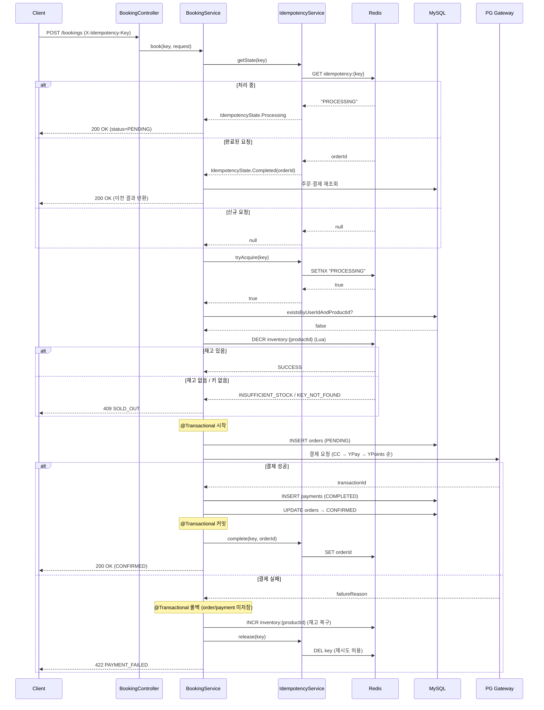
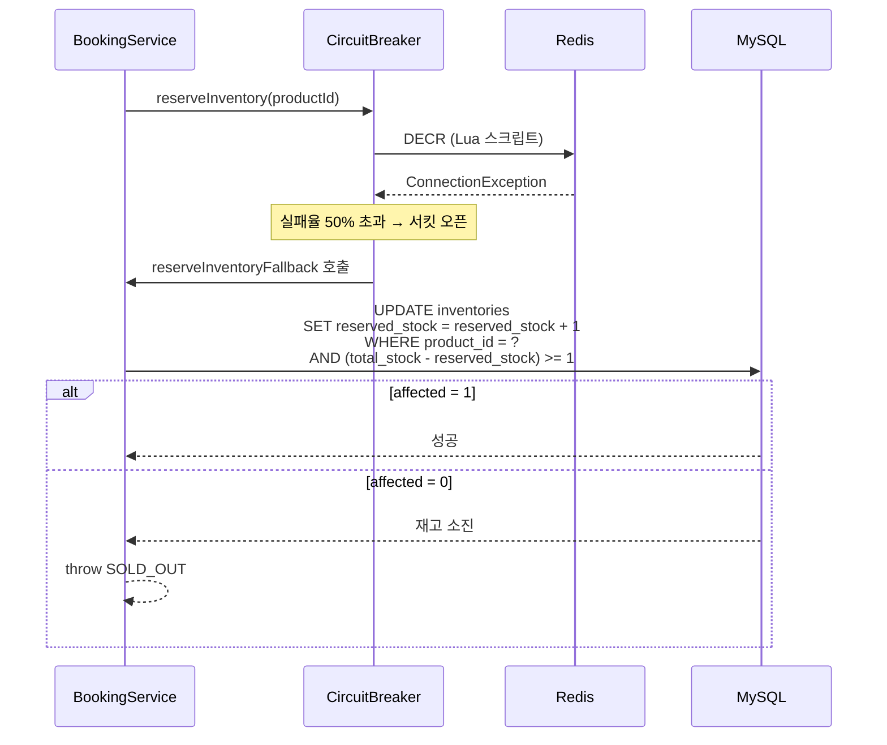
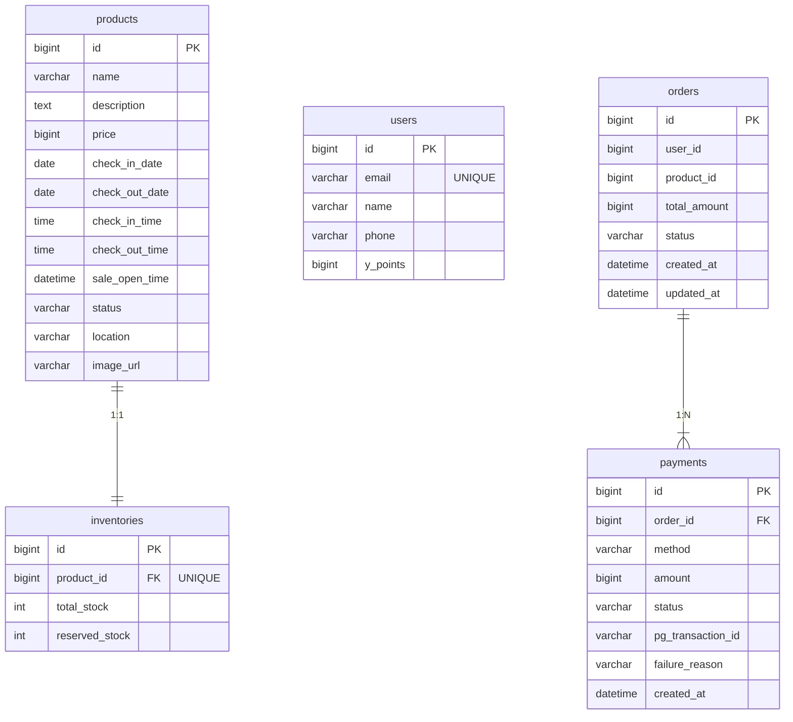

# MyBooking — 초특가 선착순 예약 시스템

00시에 오픈되는 초특가 숙소 상품(10개 한정)에 대한 선착순 예약 시스템입니다.

---

## 사전 요구사항

| 항목 | 버전 |
|------|------|
| JDK | 21 이상 |
| Docker | 최신 |
| Docker Compose | v2 이상 (`docker compose` 명령 지원) |

---

## 실행 방법

### 1. 인프라 기동

```bash
# Docker Desktop 3.4+ (Compose V2)
docker compose up -d

# 구버전 환경 (Compose V1 standalone)
docker-compose up -d
```

MySQL 8.0 (3306), Redis 7 (6379) 컨테이너를 백그라운드로 실행합니다.

### 2. 애플리케이션 실행

```bash
# 기본 프로파일 — H2 in-memory DB + Redis
./gradlew bootRun

# docker 프로파일 — MySQL + Redis
./gradlew bootRun --args='--spring.profiles.active=docker'
```

| 프로파일 | DB | Redis |
|----------|----|-------|
| `default` | H2 in-memory | localhost:6379 |
| `docker` | MySQL 8.0 (localhost:3306) | localhost:6379 |

> H2 Console: http://localhost:8080/h2-console  
> JDBC URL: `jdbc:h2:mem:mybooking`

### 3. 종료 및 정리

```bash
Ctrl+C                              # 애플리케이션 종료

docker compose down                 # 컨테이너 종료 (볼륨 유지)
docker compose down -v              # 컨테이너 종료 + 볼륨 삭제 (데이터 초기화)

# 구버전 환경
docker-compose down
docker-compose down -v
```

---

## 시스템 구조

### 컴포넌트 계층

```
클라이언트
    │  HTTP
    ▼
┌───────────────────────────────────────────┐
│             Spring Boot App               │
│                                           │
│  ┌─────────────────────────────────────┐  │
│  │  API Layer                          │  │
│  │  CheckoutController  BookingController  │
│  └──────────────┬──────────────────────┘  │
│                 │                         │
│  ┌──────────────▼──────────────────────┐  │
│  │  Application Layer                  │  │
│  │  CheckoutService    BookingService  │  │
│  └──────────────┬──────────────────────┘  │
│                 │                         │
│  ┌──────────────▼──────────────────────┐  │
│  │  Domain Layer                       │  │
│  │  Product / User / Order / Payment   │  │
│  │  Inventory                          │  │
│  └──────────────┬──────────────────────┘  │
│                 │                         │
│  ┌──────────────▼──────────────────────┐  │
│  │  Infrastructure Layer               │  │
│  │  IdempotencyService (Redis)         │  │
│  │  InventoryRedisService (Redis+Lua)  │  │
│  │    └─ Circuit Breaker → DB Fallback │  │
│  │  PaymentProcessor (Strategy)        │  │
│  │    ├─ CreditCardPaymentStrategy     │  │
│  │    ├─ YPayPaymentStrategy           │  │
│  │    └─ YPointsPaymentStrategy        │  │
│  └──────────────┬──────────────────────┘  │
└─────────────────┼─────────────────────────┘
                  │
        ┌─────────┴──────────┐
        ▼                    ▼
  ┌───────────┐        ┌───────────┐
  │  MySQL 8  │        │  Redis 7  │
  │  :3306    │        │  :6379    │
  └───────────┘        └───────────┘
```

### 내부 계층별 구조

```
src/main/kotlin/com/yun/mybooking/
│
├── api/                          # 진입점 — HTTP 요청/응답 변환
│   ├── BookingController         # POST /api/v1/bookings
│   ├── CheckoutController        # GET  /api/v1/checkout/{productId}
│   ├── ApiResponse               # 공통 응답 래퍼 {success, data, error}
│   └── GlobalExceptionHandler    # BookingException → HTTP 에러 변환
│
├── application/                  # 유스케이스 오케스트레이션
│   ├── booking/
│   │   ├── BookingService        # 멱등성 제어, 재고 선점, 결제, 주문 저장
│   │   ├── BookingRequest        # productId, userId, totalAmount, payments[]
│   │   └── BookingResponse       # bookingId, status, payments[], ...
│   └── checkout/
│       ├── CheckoutService       # 상품·사용자·재고 조회
│       └── CheckoutResponse      # product, user, availablePaymentMethods
│
├── domain/                       # 핵심 비즈니스 모델 (순수 JPA 엔티티)
│   ├── product/   Product, ProductStatus, ProductRepository
│   ├── user/      User, UserRepository
│   ├── inventory/ Inventory (totalStock, reservedStock, remainingStock),
│   │              InventoryRepository (atomicReserve via QueryDSL)
│   ├── order/     Order, OrderStatus {PENDING, CONFIRMED}, OrderRepository
│   └── payment/   Payment, PaymentMethod, PaymentStatus, PaymentRepository
│
├── infrastructure/               # 외부 시스템 연동
│   ├── idempotency/
│   │   └── IdempotencyService    # Redis SETNX — "PROCESSING" or orderId
│   ├── inventory/
│   │   ├── InventoryRedisService # Lua 스크립트 원자적 DECR/INCR
│   │   └── InventoryInitializer  # 앱 기동 시 Redis 재고 동기화
│   └── payment/
│       ├── PaymentProcessor      # 결제 수단 정렬 → 순차 처리 → 실패 시 롤백
│       ├── PaymentValidator      # 조합 규칙 및 금액 합산 검증
│       ├── PaymentStrategy       # 결제 전략 인터페이스
│       └── strategy/
│           ├── CreditCardPaymentStrategy  → CreditCardGatewayClient (Stub)
│           ├── YPayPaymentStrategy        → YPayGatewayClient (Stub)
│           └── YPointsPaymentStrategy     → DB 포인트 차감
│
└── config/
    ├── RedisConfig               # StringRedisTemplate Bean
    ├── QueryDslConfig            # JPAQueryFactory Bean
    └── JacksonConfig             # LocalDate/Time 직렬화
```

---

## 예약 흐름



### Redis 장애 시 Circuit Breaker Fallback



---

## API 명세

### GET /api/v1/checkout/{productId}

주문서 진입 시 상품 정보와 사용자 포인트를 조회합니다.

**Request**

| 위치 | 파라미터 | 타입 | 필수 | 설명 |
|------|----------|------|------|------|
| Path | `productId` | Long | Y | 상품 ID |
| Query | `userId` | Long | Y | 사용자 ID |

```
GET /api/v1/checkout/1?userId=1
```

**Response 200**

```json
{
  "success": true,
  "data": {
    "product": {
      "id": 1,
      "name": "프리미엄 오션뷰 스위트",
      "description": "탁 트인 오션뷰와 함께하는 럭셔리 숙박",
      "price": 150000,
      "checkInDate": "2026-05-10",
      "checkOutDate": "2026-05-11",
      "checkInTime": "15:00:00",
      "checkOutTime": "11:00:00",
      "saleOpenTime": "2026-05-01T00:00:00",
      "remainingStock": 8,
      "location": "제주도 서귀포시"
    },
    "user": {
      "id": 1,
      "name": "김앨리스",
      "availablePoints": 100000
    },
    "availablePaymentMethods": ["CREDIT_CARD", "Y_PAY", "Y_POINTS"]
  }
}
```

**응답 필드**

| 필드 | 타입 | 설명 |
|------|------|------|
| `product.id` | Long | 상품 PK |
| `product.price` | Long | 상품 가격 (원) |
| `product.saleOpenTime` | LocalDateTime | 판매 오픈 시각 |
| `product.remainingStock` | Int | Redis 우선 조회 후 DB fallback |
| `user.availablePoints` | Long | 결제에 사용 가능한 Y포인트 잔액 |
| `availablePaymentMethods` | List | 선택 가능한 결제 수단 목록 |

**에러 응답**

| HTTP | code | 설명 |
|------|------|------|
| 404 | `PRODUCT_NOT_FOUND` | 상품 없음 |
| 404 | `USER_NOT_FOUND` | 사용자 없음 |
| 404 | `INVENTORY_NOT_FOUND` | 재고 정보 없음 |

---

### POST /api/v1/bookings

결제를 진행하고 예약을 확정합니다.

**결제 수단 조합 규칙**

| 조합 | 허용 |
|------|------|
| CREDIT_CARD 단독 | O |
| Y_PAY 단독 | O |
| Y_POINTS 단독 | O |
| CREDIT_CARD + Y_POINTS | O |
| Y_PAY + Y_POINTS | O |
| CREDIT_CARD + Y_PAY | X |

처리 순서: CREDIT_CARD → Y_PAY → Y_POINTS (외부 PG 먼저, 포인트 차감 마지막)

**Request Headers**

| 헤더 | 필수 | 설명 |
|------|------|------|
| `X-Idempotency-Key` | Y | 중복 요청 방지용 UUID. 동일 키로 재요청 시 이전 결과 반환 |
| `Content-Type` | Y | `application/json` |

**Request Body**

| 필드 | 타입 | 필수 | 설명 |
|------|------|------|------|
| `productId` | Long | Y | 예약할 상품 ID |
| `userId` | Long | Y | 예약하는 사용자 ID |
| `totalAmount` | Long | Y | 결제 총액 (payments 합산과 일치해야 함) |
| `payments` | List | Y | 결제 수단 목록 (1개 이상) |
| `payments[].method` | String | Y | `CREDIT_CARD` \| `Y_PAY` \| `Y_POINTS` |
| `payments[].amount` | Long | Y | 해당 수단으로 결제할 금액 (원, 양수) |

```http
POST /api/v1/bookings
X-Idempotency-Key: 550e8400-e29b-41d4-a716-446655440000
Content-Type: application/json

{
  "productId": 1,
  "userId": 1,
  "totalAmount": 150000,
  "payments": [
    { "method": "CREDIT_CARD", "amount": 100000 },
    { "method": "Y_POINTS",    "amount": 50000  }
  ]
}
```

**Response 200 — 예약 확정**

```json
{
  "success": true,
  "data": {
    "bookingId": 42,
    "status": "CONFIRMED",
    "productName": "프리미엄 오션뷰 스위트",
    "checkInDate": "2026-05-10",
    "checkOutDate": "2026-05-11",
    "checkInTime": "15:00:00",
    "checkOutTime": "11:00:00",
    "totalAmount": 150000,
    "payments": [
      { "method": "CREDIT_CARD", "amount": 100000, "status": "COMPLETED", "transactionId": "cc_txn_abc" },
      { "method": "Y_POINTS",    "amount": 50000,  "status": "COMPLETED", "transactionId": "pts_txn_xyz" }
    ],
    "createdAt": "2026-05-01T00:00:01"
  }
}
```

**Response 200 — 처리 중 (동일 멱등키로 재요청)**

동일 `X-Idempotency-Key`로 이전 요청이 아직 처리 중일 때 반환됩니다.  
클라이언트는 잠시 후 동일 키로 재시도해 최종 결과를 확인합니다.

```json
{
  "success": true,
  "data": {
    "bookingId": null,
    "status": "PENDING",
    "productName": null,
    "payments": [],
    "createdAt": null
  }
}
```

**응답 필드**

| 필드 | 타입 | 설명 |
|------|------|------|
| `bookingId` | Long? | 주문 PK (PENDING 상태이면 null) |
| `status` | String | `PENDING` \| `CONFIRMED` |
| `payments[].transactionId` | String | PG 거래 ID (Y_POINTS는 내부 트랜잭션 ID) |

**에러 응답**

| HTTP | code | 설명 |
|------|------|------|
| 400 | `MISSING_IDEMPOTENCY_KEY` | `X-Idempotency-Key` 헤더 누락 또는 공백 |
| 400 | `INVALID_PAYMENT_COMBINATION` | 허용되지 않는 결제 수단 조합 (예: CC + Y_PAY) |
| 400 | `INSUFFICIENT_POINTS` | Y포인트 잔액 부족 |
| 400 | `AMOUNT_MISMATCH` | payments 합산이 totalAmount 또는 상품 가격과 불일치 |
| 404 | `PRODUCT_NOT_FOUND` | 상품 없음 |
| 404 | `USER_NOT_FOUND` | 사용자 없음 |
| 409 | `SOLD_OUT` | 재고 소진 |
| 409 | `ALREADY_PURCHASED` | 동일 사용자가 해당 상품을 이미 구매 |
| 422 | `PAYMENT_FAILED` | PG 결제 실패 (실패 시 재고 자동 복구, 멱등키 해제) |

---

## ERD



> `orders` 테이블에는 `UNIQUE (user_id, product_id)` 제약이 있습니다.  
> 실패한 주문은 `@Transactional` 롤백으로 DB에 남지 않으므로 해당 제약은 항상 CONFIRMED 주문 기준으로 동작합니다.

---

## DDL

```sql
CREATE TABLE products (
    id             BIGINT        NOT NULL AUTO_INCREMENT PRIMARY KEY,
    name           VARCHAR(200)  NOT NULL,
    description    TEXT,
    price          BIGINT        NOT NULL,
    check_in_date  DATE          NOT NULL,
    check_out_date DATE          NOT NULL,
    check_in_time  TIME          NOT NULL,
    check_out_time TIME          NOT NULL,
    sale_open_time DATETIME      NOT NULL,
    status         VARCHAR(20)   NOT NULL DEFAULT 'ACTIVE',
    location       VARCHAR(200),
    image_url      VARCHAR(500)
);

CREATE TABLE inventories (
    id             BIGINT NOT NULL AUTO_INCREMENT PRIMARY KEY,
    product_id     BIGINT NOT NULL UNIQUE,
    total_stock    INT    NOT NULL,
    reserved_stock INT    NOT NULL DEFAULT 0
);

CREATE TABLE users (
    id       BIGINT        NOT NULL AUTO_INCREMENT PRIMARY KEY,
    email    VARCHAR(200)  NOT NULL UNIQUE,
    name     VARCHAR(100)  NOT NULL,
    phone    VARCHAR(20),
    y_points BIGINT        NOT NULL DEFAULT 0
);

CREATE TABLE orders (
    id           BIGINT      NOT NULL AUTO_INCREMENT PRIMARY KEY,
    user_id      BIGINT      NOT NULL,
    product_id   BIGINT      NOT NULL,
    total_amount BIGINT      NOT NULL,
    status       VARCHAR(20) NOT NULL DEFAULT 'PENDING',
    created_at   DATETIME    NOT NULL,
    updated_at   DATETIME    NOT NULL,
    CONSTRAINT uq_orders_user_product UNIQUE (user_id, product_id)
);

CREATE TABLE payments (
    id                BIGINT        NOT NULL AUTO_INCREMENT PRIMARY KEY,
    order_id          BIGINT        NOT NULL,
    method            VARCHAR(20)   NOT NULL,
    amount            BIGINT        NOT NULL,
    status            VARCHAR(20)   NOT NULL DEFAULT 'PENDING',
    pg_transaction_id VARCHAR(200),
    failure_reason    VARCHAR(500),
    created_at        DATETIME      NOT NULL
);
```
