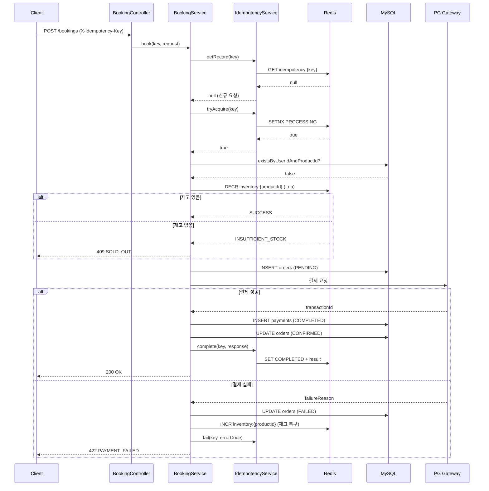
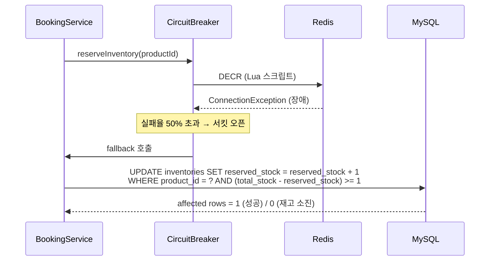
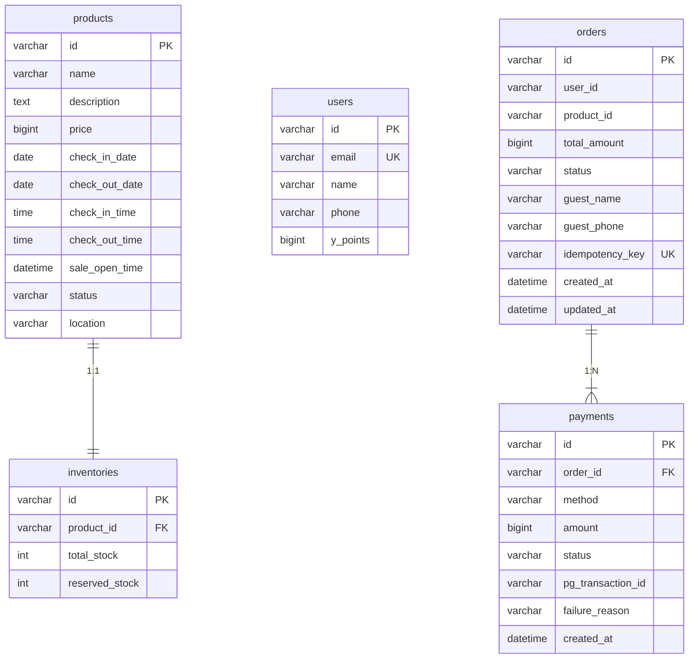

# MyBooking — 초특가 선착순 예약 시스템

00시에 오픈되는 초특가 숙소 상품(10개 한정)에 대한 선착순 예약 시스템입니다.

---

## 실행 방법

### 사전 요구사항
- JDK 21
- Docker & Docker Compose

### 빠른 시작

```bash
# 1. Redis 기동 (필수)
docker compose up -d

# 2. 앱 실행 (H2 in-memory + Redis)
./gradlew bootRun

# MySQL까지 사용하려면
./gradlew bootRun --args='--spring.profiles.active=docker'
```

### 종료

```bash
Ctrl+C                   # 앱 종료
docker compose down      # 컨테이너 종료 (데이터 유지)
docker compose down -v   # 컨테이너 종료 + 볼륨 삭제 (데이터 초기화)
```

| 프로파일 | DB | Redis |
|----------|----|-------|
| `default` | H2 in-memory | localhost:6379 |
| `docker` | MySQL 8.0 | localhost:6379 |

H2 Console: http://localhost:8080/h2-console (JDBC URL: `jdbc:h2:mem:mybooking`)

---

## 시스템 아키텍처

```
클라이언트
    │
    ▼
┌─────────────────────────────┐
│  Spring Boot Application    │
│                             │
│  CheckoutController         │   GET  /api/v1/checkout/{productId}
│  BookingController          │   POST /api/v1/bookings
│                             │
│  BookingService             │
│   ├─ IdempotencyService ────┼──► Redis (멱등성 키 관리)
│   ├─ InventoryRedisService ─┼──► Redis (재고 카운터 + Lua 스크립트)
│   │   └─ Circuit Breaker    │
│   │       └─ Fallback ──────┼──► MySQL (원자적 UPDATE)
│   └─ PaymentProcessor       │
│       ├─ CreditCard Strategy┼──► CreditCardGatewayClient (Stub)
│       ├─ YPay Strategy ─────┼──► YPayGatewayClient (Stub)
│       └─ YPoints Strategy───┼──► MySQL (포인트 차감)
│                             │
└─────────────────────────────┘
         │           │
         ▼           ▼
      MySQL        Redis
```

---

## 시퀀스 다이어그램

### POST /api/v1/bookings (예약 흐름)



### Redis 장애 시 Fallback



---

## API 명세

### GET /api/v1/checkout/{productId}

주문서 진입 시 상품 정보와 사용자 포인트를 조회합니다.

**Request**
```
GET /api/v1/checkout/prod-001?userId=user-001
```

**Response 200**
```json
{
  "success": true,
  "data": {
    "product": {
      "id": "prod-001",
      "name": "프리미엄 오션뷰 스위트",
      "description": "탁 트인 오션뷰...",
      "price": 150000,
      "checkInDate": "2026-05-10",
      "checkOutDate": "2026-05-11",
      "checkInTime": "15:00:00",
      "checkOutTime": "11:00:00",
      "saleOpenTime": "2026-05-01T00:00:00",
      "remainingStock": 10,
      "location": "제주도 서귀포시"
    },
    "user": {
      "id": "user-001",
      "name": "김앨리스",
      "availablePoints": 100000
    },
    "availablePaymentMethods": ["CREDIT_CARD", "Y_PAY", "Y_POINTS"]
  }
}
```

---

### POST /api/v1/bookings

결제를 진행하고 예약을 확정합니다.

**결제 수단 조합 규칙**
- `CREDIT_CARD` 단독, `Y_PAY` 단독, `Y_POINTS` 단독 허용
- `CREDIT_CARD + Y_POINTS` 허용
- `Y_PAY + Y_POINTS` 허용
- `CREDIT_CARD + Y_PAY` **불가**

**Request**
```
POST /api/v1/bookings
X-Idempotency-Key: 550e8400-e29b-41d4-a716-446655440000
Content-Type: application/json
```
```json
{
  "productId": "prod-001",
  "userId": "user-001",
  "guestName": "홍길동",
  "guestPhone": "010-1234-5678",
  "totalAmount": 150000,
  "payments": [
    {
      "method": "CREDIT_CARD",
      "amount": 100000,
      "cardToken": "card_tok_xxx"
    },
    {
      "method": "Y_POINTS",
      "amount": 50000
    }
  ]
}
```

**Response 200**
```json
{
  "success": true,
  "data": {
    "bookingId": "a1b2c3d4-...",
    "status": "CONFIRMED",
    "productName": "프리미엄 오션뷰 스위트",
    "checkInDate": "2026-05-10",
    "checkOutDate": "2026-05-11",
    "checkInTime": "15:00:00",
    "checkOutTime": "11:00:00",
    "totalAmount": 150000,
    "payments": [
      { "method": "CREDIT_CARD", "amount": 100000, "status": "COMPLETED", "transactionId": "cc_xxx" },
      { "method": "Y_POINTS",    "amount": 50000,  "status": "COMPLETED", "transactionId": "points_xxx" }
    ],
    "createdAt": "2026-05-01T00:00:01"
  }
}
```

**에러 응답**

| HTTP | code | 설명 |
|------|------|------|
| 400 | `MISSING_IDEMPOTENCY_KEY` | X-Idempotency-Key 헤더 누락 |
| 400 | `INVALID_PAYMENT_COMBINATION` | 결제 수단 조합 불가 |
| 400 | `AMOUNT_MISMATCH` | 결제 금액 합산 불일치 |
| 404 | `PRODUCT_NOT_FOUND` | 상품 없음 |
| 404 | `USER_NOT_FOUND` | 사용자 없음 |
| 409 | `SOLD_OUT` | 재고 소진 |
| 409 | `ALREADY_PURCHASED` | 이미 구매한 상품 |
| 409 | `IDEMPOTENCY_PROCESSING` | 동일 요청 처리 중 |
| 422 | `PAYMENT_FAILED` | 결제 실패 |

---

## ERD



---

## DDL

```sql
CREATE TABLE products (
    id            VARCHAR(36)   NOT NULL PRIMARY KEY,
    name          VARCHAR(200)  NOT NULL,
    description   TEXT,
    price         BIGINT        NOT NULL,
    check_in_date DATE          NOT NULL,
    check_out_date DATE         NOT NULL,
    check_in_time TIME          NOT NULL,
    check_out_time TIME         NOT NULL,
    sale_open_time DATETIME     NOT NULL,
    status        VARCHAR(20)   NOT NULL DEFAULT 'ACTIVE',
    location      VARCHAR(200),
    image_url     VARCHAR(500)
);

CREATE TABLE inventories (
    id             VARCHAR(36) NOT NULL PRIMARY KEY,
    product_id     VARCHAR(36) NOT NULL UNIQUE,
    total_stock    INT         NOT NULL,
    reserved_stock INT         NOT NULL DEFAULT 0
);

CREATE TABLE users (
    id       VARCHAR(36)  NOT NULL PRIMARY KEY,
    email    VARCHAR(200) NOT NULL UNIQUE,
    name     VARCHAR(100) NOT NULL,
    phone    VARCHAR(20),
    y_points BIGINT       NOT NULL DEFAULT 0
);

CREATE TABLE orders (
    id              VARCHAR(36)  NOT NULL PRIMARY KEY,
    user_id         VARCHAR(36)  NOT NULL,
    product_id      VARCHAR(36)  NOT NULL,
    total_amount    BIGINT       NOT NULL,
    status          VARCHAR(20)  NOT NULL DEFAULT 'PENDING',
    guest_name      VARCHAR(100) NOT NULL,
    guest_phone     VARCHAR(20),
    idempotency_key VARCHAR(100) NOT NULL,
    created_at      DATETIME     NOT NULL,
    updated_at      DATETIME     NOT NULL,
    CONSTRAINT uq_orders_idempotency_key UNIQUE (idempotency_key),
    CONSTRAINT uq_orders_user_product    UNIQUE (user_id, product_id)
);

CREATE TABLE payments (
    id                VARCHAR(36)  NOT NULL PRIMARY KEY,
    order_id          VARCHAR(36)  NOT NULL,
    method            VARCHAR(20)  NOT NULL,
    amount            BIGINT       NOT NULL,
    status            VARCHAR(20)  NOT NULL DEFAULT 'PENDING',
    pg_transaction_id VARCHAR(200),
    failure_reason    VARCHAR(500),
    created_at        DATETIME     NOT NULL
);
```
